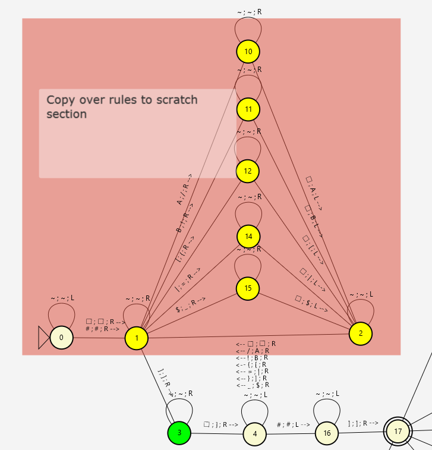
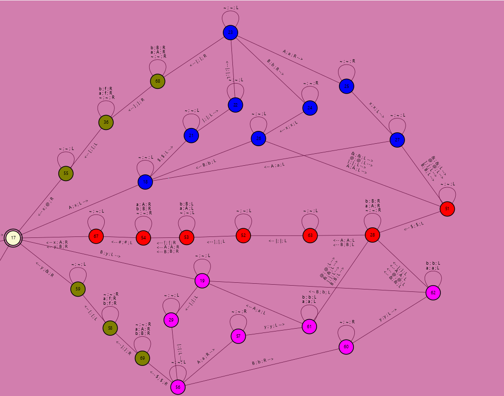

COSC 312  
HW 8b: Turing Machine Project  
19 April 2026  

# Territorial Battle Simulation

## Contributors
*Vincent Guo - creating duplicator, debugging parser, and writing writeup.*  
*Minjae Bae - idea execution, creating parser, and debugging.*

## Problem Description

The goal of this project was to develop a Turing machine that could simulate a territorial battle between two animals in a crowded environment (a 1D tape), where the user can initalize the starting board configuration, some rules, and the number of iterations. 

The turing machine then iteratively applies the rules, scanning from left to right, applying the user-defined rules on each animal. 

## Input String
The program takes input in the following format:  
```[.|.|.$.|.|.]S#```

- ```.``` and ```S``` are ```(A|B)*```, *no spaces.*  
- ```S``` **MUST** be ```#```-terminated, with only a single ```#```. ```#``` is used to mark the end of the board. Without ```#```, expect infinite loops. 
- Rule delimiters are ```[```, ```|```, ```$```.
- You may only define rules in this format: ```[.|.|.$.|.|.]S#```

We will refer to the ```[.|.|.$.|.|.]``` segment as the **RULES** and the ```S#``` segment as the **BOARD**.

### Example Inputs:

**GOOD:**
- ```[||$||]#```
- ```[B||$A||]ABABABABAB#```
- ```[AA|AA|AB$A|BB|A]BBAAABA#```
- ```[ABABABAB|AAAA|$A|BB|]ABABABABA#```

**BAD:** the turing machine cannot process these kinds of inputs.
- ```[B|AA|$A|BB|]BAAABBB```  (missing #)
- ```[b|aa|$a|bb|]BBBBBBB#``` (invalid characters)
- ```[b|aa$a|bb|]BBBBBBB#```  (missing delimiters)

*The Turing Machine should work for arbritarily long strings, but it may take a couple of minutes.*

## Understanding the rules
```[.|.|.$.|.|.]``` is where the user defines the rules for the simulation.

The rules for species ```A``` are defined in the first ```[.|.|.$``` chunk.  
The rules for species ```B``` are defined in the second ```$.|.|.]``` chunk.

Species rules are interpreted as **HUNT|REPRODUCE|TRANSFORM**. That might not make much sense, so let us give an example.

E.g. ```[AA|AA|AB$A|BB|]BBAAABA#```  
First, we look at the rules for species ```A``` in the ```[BB|A|AB$``` chunk.  

### Interpreting ```[BB|A|AB$```:  
1. ```[AA|```: this defines what species ```A``` can hunt. If ```A``` is adjacent to a sequence of **AT LEAST** 2 ```A```'s, the 2 adjacent ```A```'s are marked as prey.
2. ```|AA|```: if ```A``` **meets** the hunting condition, **REPLACE** ```A``` with ```AA```. Note that if the hunting section contains no letters, ```A``` will always execute this path.
3. ```|AB$```: if ```A``` **fails to meet** the hunting condition, **REPLACE** ```A``` with ```AB```.

*Order matters. Specifying that species ```A``` can hunt ```BA``` does not allow them to hunt ```AB```.*  
*E.g. if the board were like this and we were interested in the lone ```A```, which we say can hunt ```BA```*  
- ```BA``` ```A``` would lead to a successful hunt.
- ```A``` ```BA``` would lead to a successful hunt.
- ```A``` ```AB``` would **NOT** lead to a successful hunt.
- ```AB``` ```A``` would **NOT** lead to a successful hunt.

### Interpreting ```$A|BB|]```:
1. ```$A|```: this defines what species ```B``` can hunt. If ```B``` is adjacent to a sequence of **AT LEAST** 1 ```A```, the adjacent ```A```'s is marked as prey.
2. ```|BB|```: if ```B``` **meets** the hunting condition, **REPLACE** ```B``` with ```BB```. 
3. ```|]```: if ```B``` **fails to meet** the hunting condition, **REPLACE** ```B``` with nothing.

*Note that if 2 delimiters have no ```A```'s or ```B```'s in between, e.g. ```[|```, ```||```, ```|$```, ```$|```, ```|]```, it is assumed that the rule is empty.*

---

### Parsing Precedence

*The parser always evaluates left precedence over right precedence. An animal only attempts to hunt other animals to the right if it cannot find the animals it needs to hunt on the left.* 

*If we were currently reading the ```A``` using the same rules, ```BBABB``` evaluates to ```AB BB``` **not** ```BB ABB``` (spaces are not allowed in the board, but relevant characters are grouped together for clarity in this example) after hunting. This prevents ambiguity.*

*Also, animals that have already been marked as prey by one animal cannot be marked as prey again by another animal. Animals that likewise have sucessfully hunted other animals cannot be hunted by another animal (these animals have already established themselves as apex predators, and it would make little sense to hunt them). Everyone else? Fair game. This will make more sense in the example.*

## Approach

### Step 1: Copying Rules

Before parsing the board, we copy the RULES section to the end. We have to do this at some point, so doing it at the beginning was what we elected to do. This is done via a duplicator.



Nodes 0 sets the turing pointer to the first element of the input string. We then loop (yellow nodes), marking elements as we go and copying characters to the first instance of whitespace, before looping back and using the mark to find the next element we need to copy. This is done until we reach the end of the rules, marked by ```]```. 

After this step:
- ```[AA|AA|AB$A|BB|]BBAAABA#``` becomes ```[AA|AA|AB$A|BB|]BBAAABA#[AA|AA|AB$A|BB|]```.  
- ```[||$||]BBABBA#``` becomes ```[||$||]BBABBA#[||$||]```.

---

### Step 2: Parsing the board
Continuing with ```[AA|AA|AB$A|BB|]BBAAABA#```.  

(```[AA|AA|AB$A|BB|]BBAAABA#[AA|AA|AB$A|BB|]``` after step 1)  

We read the board ```BBAAABA#```.  

*How is this done?*  
Through the left and right parsers. Here's an image: 



The entry point is on node 17.  

- Blue Nodes - these encode A's rules
- Magenta Nodes - these encode B's rules
- Olive Nodes - these states encode successful matching of hunt rules. If we get to an olive node, reset the rules, mark the animal as having completed its hunt (and its prey as dead). Then parse the next non-dead (```A``` or ```B```) animal.
- Red Nodes - these encode when an animal sees a mismatch between what it can hunt and what it sees. For these, we reset the error state, and move on to the right parser.

In this example, the left parser is not connected to the right parser (since we were testing it). 
Node 67 is the exit point for which we would start right parsing.

## Parser walkthrough

Let's read a string together, as if we were the Turing Machine.  

We will use the input string ```[AA|AA|AB$A|BB|]yBAAABA#```  

After copying the rules initally, we have ```[AA|AA|AB$A|BB|]yBAAABA#[AA|AA|AB$A|BB|]``` entering into the parser.

### **(i):**  
We read ```B```. This means use ```B```'s rules (```$A|BB|]```). 

We first keep track of our current char by marking the animal we are currently interested in (```B```) as ```y```, and then scan left to the first letter or ```$``` we see. We have to ping-pong back and forth because we do not know how long the sequence of what animal ```B``` can hunt is.  

We see ```B``` can hunt ```A```. We then scan back to ```y``` and read ```[```. 

Since ```B```'s can only hunt ```A```, ```B``` does not meet the requirements to hunt and then reproduce.

(current state: ```[AA|AA|AB$A|BB|]yBAAABA#[AA|AA|AB$A|BB|]```) 

Since ```y```'s hunt was unsuccessful, we scan right. We see that to the right of ```y``` is a ```B```. But ```B``` can only hunt ```A```, not ```B```. We revert ```y``` back to ```B```, indicating that the animal could not hunt for food. Then, we start the scanning process over again for the next non-lowercase element.  

---

### **(ii):**
The next element we scan is also a ```B```, so it gets converted temporarily to a ```y```.

(current state: ```[AA|AA|AB$A|BB|]ByAAABA#[AA|AA|AB$A|BB|]```) 

We now repeat **(i)**. Scanning left, we find a ```B```. That does not match an ```A```, so we continue by scanning right. 

Scanning right, we find ```A```. That matches what ```B``` can hunt. We mark ```A``` as ```B```'s prey by writing ```A``` in lowercase and continue to the next element. ```B``` also gets converted to an ```&``` to signify that it will reproduce.

(current state: ```[AA|AA|AB$A|BB|]B&aAABA#[AA|AA|AB$A|BB|]```) 

---

### **(iii):**

We scan ```a``` next. But ```a``` has already been marked as prey. So we skip ```a``` and scan to the next non-lowercase element (the ```A```). Mark ```A``` as ```x``` to denote that it is the current animal we are interested in. 

(current state: ```[AA|AA|AB$A|BB|]B&axABA#[AA|AA|AB$A|BB|]```) 

To the left of ```x``` is an ```a```. However, it is in lowercase, so it has already been marked as prey by another animal. ```x``` cannot feast on it. 

We then scan right. To the right of ```x``` is ```AB``` not ```AA```, so ```x``` cannot hunt. We revert ```x``` back to ```A```, signifying it did not successfully hunt and can still be eaten. We continue.

---

### **(iv):**

You should get the hang of this by now. Replace the current scanned animal with a temporary variable (we use ```x``` for ```A```), then scan left and right.

(current state: ```[AA|AA|AB$A|BB|]B&aAxBA#[AA|AA|AB$A|BB|]```) 

To the left, there is ```aA```, but ```a``` doesn't count, since that food source has already been taken by someone else.

Scanning to the right, we see ```BA```. That doesn't match ```AAA```, so our current marked animal gets to transform. For now, our ```x``` will remain an ```A```. 

---

### **(v)**

Again, replace the current scanned variable with a fitting alias. We use ```y``` since this is an animal of species ```B```.

(current state: ```[AA|AA|AB$A|BB|]B&aAAyA#[AA|AA|AB$A|BB|]```) 

We scan left first. To the left of ```y``` is ```AA```, so our current animal has found his prey.  

We modify the ```A``` left of the the ```y``` to ```a```, to show that the ```A``` has been preyed upon.  

Since ```y``` had a nice meal, it can now reproduce, so we replace ```y``` with ```&``` and then move on to the final animal. Note that since the animal got its food from hunting creatures to the left of it, it sees no need to hunt animals to the right of it. 

(current state: ```[AA|AA|AB$A|BB|]B&aAa&A#[AA|AA|AB$A|BB|]```) 

---

### **(vi)**

Now we look at the ```A``` right before the ```#```. To the left of it is an ```&```, meaning an animal who has already hunted. You cannot hunt an animal who has already hunted (since hunting an animal who has already hunted might lead you to the one being the prey)?

To the right is ```#```. That means the end of the board. Since neither scans bring up ```AA```, the last animal we see does not successifully hunt, so it transforms. 

## Step 3: Expanding

So now we have a string like this: 
```[AA|AA|AB$A|BB|]B&aAa&A#[AA|AA|AB$A|BB|]```  

We want our final output to be like so: 
```[.|.|.$.|.|.]S#```  

That way, the output of this program can be cycled over and over again.  

The last thing to do is to copy over the new board so we get another string in the following format (```[.|.|.$.|.|.]S#```) without the ```@``` and ```&```.  

This is done via a very simple copy algorithm:
- Capital letters (```A```, ```B```) are animals who were unable to hunt but were lucky enough to not be preyed upon. This means copying over the corresponding TRANSFORM rules when one of these is encountered.
- ```@``` and ```&``` are used for encoding animals for species ```A``` and ```B``` respectively who were able to hunt. 
- Lowercase letters (```A```, ```B```) are the unlucky ones. They were preyed upon and are now presumed to be dead. We will not keep records of them in the next board.  

Trace:
- ```B &aAa&A```  (B->nothing)
- ```& aAa&A```   (&->BB)
- ```BB a Aa&A``` (a->nothing, presumed to be dead)
- ```BB A a&A```  (A->AB)
- ```BBAB a &A``` (a->nothing, presumed to be dead)
- ```BBAB & A```  (&->BB)
- ```BBABBB A```  (A->AB)
- ```BBABBBAB```  (Complete board)
- ```BBABBBAB#``` (Add #-termination)

When done to completion, ```[AA|AA|AB$A|BB|]B&aAa&A#[AA|AA|AB$A|BB|]``` becomes ```[AA|AA|AB$A|BB|]BBABBBAB#```